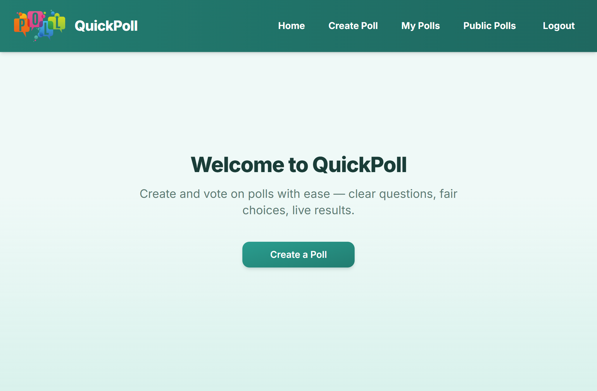
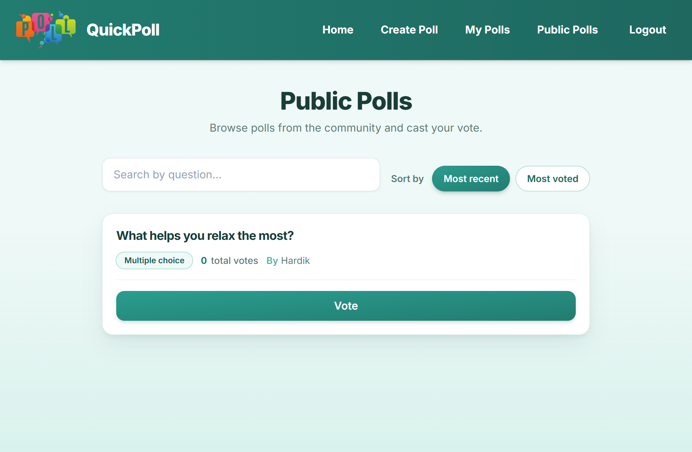
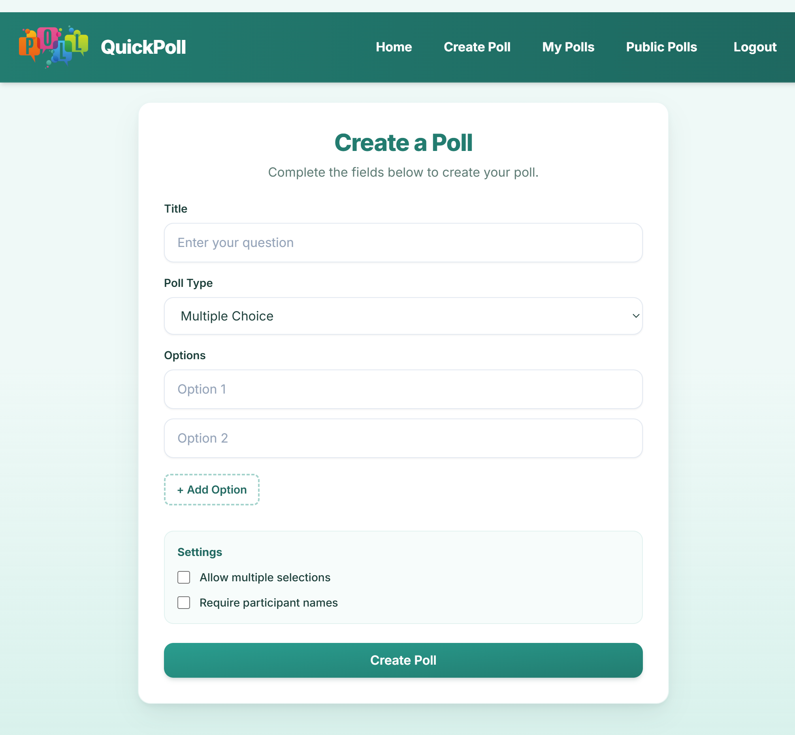
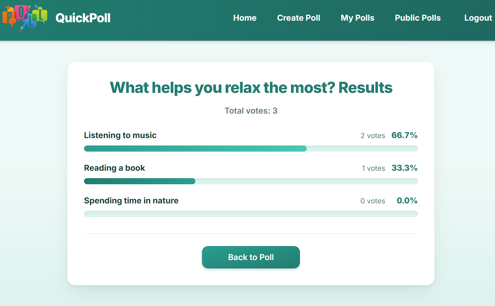

# QuickPoll

**QuickPoll** is a full-stack polling platform that enables users to create, share, and participate in polls with real-time results and a modern, responsive UI.

---

## ✨ Features

- **User accounts** — Sign up, log in, and JWT-protected routes for your polls  
- **Create polls** — Multiple or single choice, optional multiple selections and named voters  
- **Vote & results** — Cast votes, live updates via WebSockets, and percentage breakdowns with progress bars  
- **My Polls** — List, edit, and delete polls you own  
- **Public Polls** — Browse all polls, search by question, and sort by recency or vote count  
- **Responsive UI** — Tailwind CSS layout that works across phone, tablet, and desktop  

---

## 🛠 Tech Stack

| Layer | Technologies |
|--------|----------------|
| **Frontend** | React 18, React Router, Tailwind CSS, Axios |
| **Backend** | Node.js, Express, Socket.IO |
| **Database** | MongoDB (Mongoose ODM) |

---

## 📸 Screenshots

### Home



### Public Polls



<details>
<summary><strong>More screenshots</strong></summary>

### Create Poll



### Results



</details>

---

## 🚀 Getting Started

### Prerequisites

- [Node.js](https://nodejs.org/) (v18+ recommended)  
- [MongoDB](https://www.mongodb.com/) (local or Atlas connection string)  
- npm (comes with Node)

### Installation

1. **Clone the repository**

   ```bash
   git clone <your-repo-url>
   cd poll-maker
   ```

2. **Install frontend dependencies** (repository root)

   ```bash
   npm install
   ```

3. **Install backend dependencies**

   ```bash
   cd backend
   npm install
   cd ..
   ```

### Backend setup

1. Create `backend/.env` (see [Environment variables](#-environment-variables)).

2. Start the API server:

   ```bash
   cd backend
   npm run dev
   ```

   The server defaults to **port 5000** (or `PORT` from `.env`).

### Frontend setup

1. From the **repository root**, start the React app:

   ```bash
   npm start
   ```

2. Open [http://localhost:3000](http://localhost:3000). The dev server proxies API calls to the backend when using the default Create React App `proxy` to `http://localhost:5000`.

### 🔐 Environment variables

**`backend/.env`** (required for the API):

| Variable | Description |
|----------|-------------|
| `MONGO_URI` | MongoDB connection string |
| `JWT_SECRET` | Secret used to sign authentication tokens |
| `PORT` | *(optional)* Server port (default: `5000`) |

**Frontend** *(optional — for production or custom API URL)*:

| Variable | Description |
|----------|-------------|
| `REACT_APP_API_URL` | Base URL of the API (e.g. `https://api.example.com`). If unset, the app uses `http://localhost:5000` in development via the bundled API client defaults. |

> **Note:** Never commit real `.env` files. Add `.env` to `.gitignore` and use `.env.example` in teams when sharing variable names only.

---

## 📁 Folder Structure

```
poll-maker/
├── public/                 # Static assets (CRA)
├── screenshots/            # README screenshots (add your images here)
├── src/
│   ├── api/                # Axios client
│   ├── components/         # Reusable UI (Button, Navbar, PollCard, PollForm)
│   ├── lib/                # Utilities (e.g. class name helper)
│   ├── pages/              # Route-level views
│   ├── App.jsx
│   └── index.js
├── backend/
│   ├── server.js           # Entry: loads src/server
│   └── src/
│       ├── app.js          # Express app + middleware
│       ├── server.js       # HTTP server, Socket.IO, DB connect
│       ├── config/         # DB, CORS constants
│       ├── controllers/
│       ├── middleware/
│       ├── models/         # Mongoose schemas
│       ├── routes/
│       ├── services/
│       ├── sockets/
│       └── utils/
├── package.json
├── tailwind.config.js
└── README.md
```

---

## 🗺️ Roadmap

- **Tests** — Broader API and E2E coverage (e.g. Playwright)  
- **Roles & moderation** — Admin tools and report flows for public polls  
- **Rate limiting & validation** — Stricter API limits and shared schema validation (e.g. Zod)  
- **Deployment** — Docker Compose, CI/CD, and environment-specific configs  
- **Accessibility** — Deeper WCAG audit and keyboard-only flows  

---

## 👤 Author

Kavya Rai  
IIT Kharagpur

